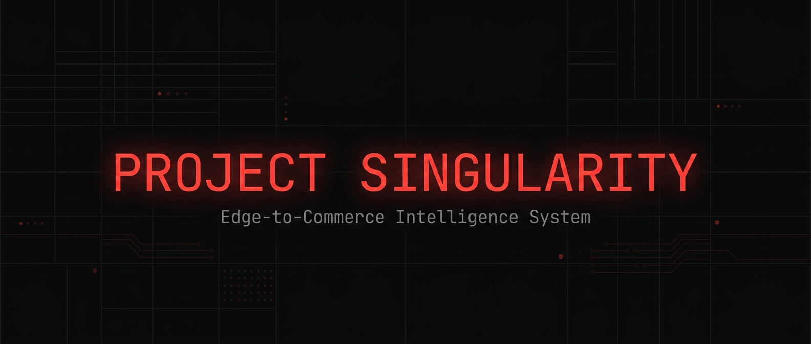
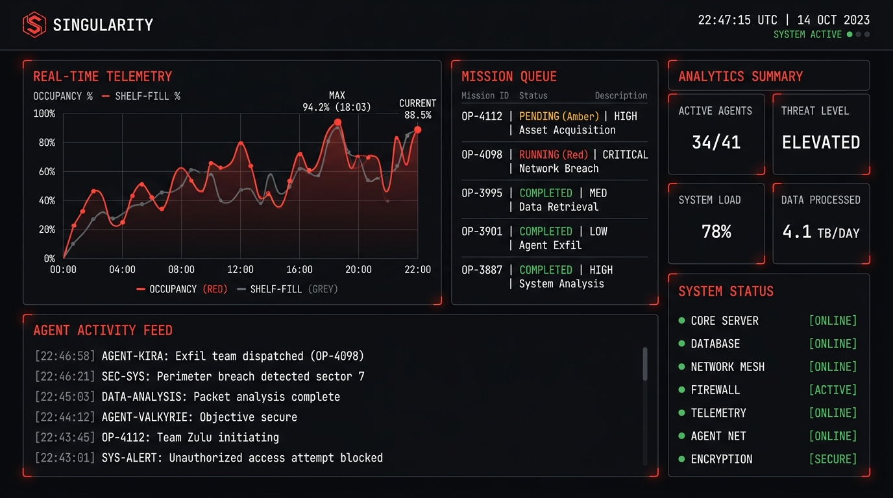
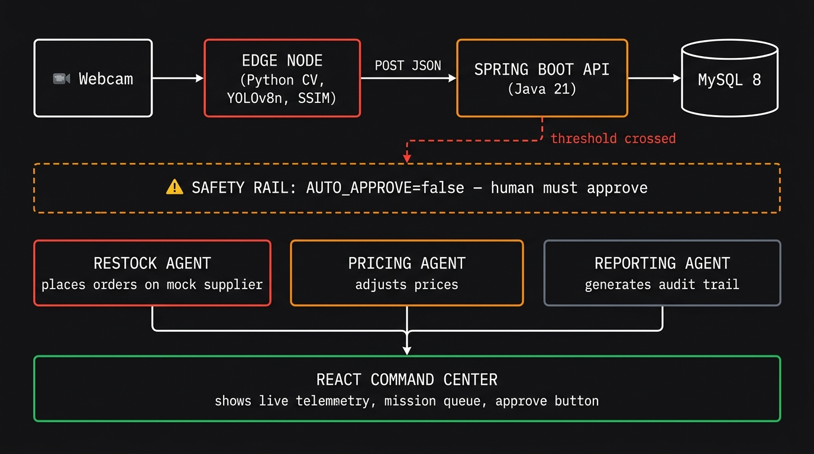

<p align="center">
  
</p>

<p align="center">
  <strong>An agentic edge-to-commerce intelligence system that watches a shelf, thinks about what it sees, and acts on it — with a human in the loop.</strong>
</p>

<p align="center">
  <a href="https://github.com/xxxASHxxx/project-singularity/actions/workflows/ci.yml"></a>
  
  
  
  
  <a href="LICENSE"></a>
</p>

<br/>

> **Camera → Detection → Agents → Commerce.**  
> The whole loop runs in under 2 minutes — from "shelf is getting empty" to "purchase order confirmed."

<br/>

---

## 🎬 How it works

A camera watches a store shelf. When things change — too many people or too little stock — the system creates a **mission** that needs your approval. Once you approve, AI agents kick in automatically.

```
  📹 Webcam           🧠 Edge Node          ⚡ Spring Boot API         🗄️ MySQL
  ─────────  ──→  ─────────────────  ──→  ────────────────────  ──→  ─────────
  720p RGB         YOLOv8n persons          POST /api/v1/telemetry     Persists
  live feed        SSIM shelf-fill          Threshold checking         everything
                   every 5 seconds          Mission creation
```

When a threshold is crossed:

```
                         ┌──────────────────────────────────┐
                         │  ⚠  SAFETY RAIL                  │
                         │  AUTO_APPROVE = false             │
                         │  human must approve in dashboard  │
                         └──────────────────────────────────┘
                                       │
                    ┌──────────────────┼──────────────────┐
                    ▼                  ▼                  ▼
            🔴 Restock Agent    🟠 Pricing Agent    ⚪ Reporting Agent
            Places purchase     Adjusts prices       Generates full
            orders on mock      (+15% cap on         audit trail with
            supplier site       surge pricing)       Markdown artifacts
```

Everything converges in the **React Command Center** — a technical noir dashboard where you watch telemetry flow, approve missions, and see agents work in real time.

<br/>

<p align="center">
  
</p>
<p align="center"><em>The command center — live telemetry, mission queue, agent activity feed, system status. All in one place.</em></p>

<br/>

---

## 🚀 Quick Start

You can have the full system running in about 10 minutes. No cloud accounts needed.

### Prerequisites

| Tool | Version | Required? |
|------|---------|-----------|
| Docker Desktop | with Compose v2 | ✅ Yes |
| Python | 3.10+ | Only for local edge dev |
| Node.js | 20+ | Only for mock supplier dev |
| Java + Maven | 21 | Only for API dev |

### 1. Clone and configure

```bash
git clone https://github.com/xxxASHxxx/project-singularity.git
cd project-singularity
cp .env.example .env    # defaults work out of the box
```

### 2. Fire up the full stack

```bash
docker compose up --build
```

This starts **everything**: MySQL 8, Spring Boot API (`:8080`), Mock Supplier (`:3001`), React Frontend (`:5173`), and the Edge Node in mock mode.

Wait for `api | Started SingularityApplication` in the logs — that's your green light.

### 3. Open the dashboard

Head to **http://localhost:5173**. Within 60 seconds you'll see telemetry events start rolling in as the edge node replays its demo sequence.

### 4. Approve a mission

Find the `PENDING_APPROVAL` mission in the queue. Click **Approve**. That's the human-in-the-loop moment.

### 5. Watch agents work

- **Restock Agent** → browses the mock supplier, adds to cart, places a purchase order
- **Pricing Agent** → calculates a surge price adjustment (capped at +15%), writes a rationale
- **Reporting Agent** → assembles the full audit trail as Markdown artifacts

### Running the edge node locally

If you want to tinker with the edge node outside of Docker:

```bash
pip install -r edge/requirements.txt

# Mock mode — no webcam required, great for development
python edge/main.py --mock

# Live mode — with a real webcam
python edge/calibrate.py --camera 0    # capture shelf baseline first
python edge/main.py --camera 0          # then run live detection
```

<br/>

---

## 🏗️ Architecture

<p align="center">
  
</p>

<br/>

### Tech Stack

<table>
  <tr>
    <th>Layer</th>
    <th>Technology</th>
    <th>What it does</th>
  </tr>
  <tr>
    <td><strong>🧠 Edge Node</strong></td>
    <td>Python · OpenCV · YOLOv8n · scikit-image</td>
    <td>Person detection + shelf-fill analysis via SSIM. Posts telemetry JSON every 5s.</td>
  </tr>
  <tr>
    <td><strong>⚡ API</strong></td>
    <td>Java 21 · Spring Boot · Flyway · MySQL 8</td>
    <td>Telemetry ingestion, threshold checking, mission lifecycle, Razorpay integration.</td>
  </tr>
  <tr>
    <td><strong>🖥️ Frontend</strong></td>
    <td>React 18 · TypeScript · TanStack Query · Vite</td>
    <td>Real-time command center with telemetry charts, mission queue, agent activity feed.</td>
  </tr>
  <tr>
    <td><strong>🏪 Mock Supplier</strong></td>
    <td>Next.js 14 · SQLite</td>
    <td>Sandboxed vendor site where restock agents place demo purchase orders.</td>
  </tr>
  <tr>
    <td><strong>🐳 Infrastructure</strong></td>
    <td>Docker Compose · GitHub Actions CI</td>
    <td>One-command full stack. CI runs Python lint, tests, and frontend type-check.</td>
  </tr>
</table>

<br/>

### 🛡️ Safety Rails

This project is designed to be **safe by default**. No surprises.

- `AUTO_APPROVE=false` — every mission needs a human click before agents act
- **Mock supplier** is a local sandboxed site — agents never touch real e-commerce
- **No facial recognition** or biometric code anywhere in this repo
- **Razorpay runs in TEST mode** — no real money is ever charged
- Surge pricing is **capped at +15%** — hard limit, not configurable

<br/>

---

## ⚙️ Configuration

All config lives in a single `.env` file. Copy the example and you're good to go.

```bash
cp .env.example .env    # all defaults work for local development
```

<details>
<summary><strong>📋 Full environment variable reference</strong></summary>

<br/>

| Variable | Default | What it controls |
|----------|---------|-----------------|
| `DB_URL` | `jdbc:mysql://mysql:3306/singularity` | MySQL JDBC connection string |
| `DB_USER` | `singularity` | Database username |
| `DB_PASSWORD` | `singularity_pass` | Database password |
| `CORS_ALLOWED_ORIGIN` | `http://localhost:5173` | Allowed origin for the React app |
| `AUTO_APPROVE` | `false` | Skip the human approval gate (⚠️ keep false) |
| `SURGE_THRESHOLD` | `4` | Number of people to trigger a surge event |
| `LOW_STOCK_THRESHOLD` | `20` | Shelf fill % below which low-stock triggers |
| `RAZORPAY_KEY_ID` | `rzp_test_...` | Razorpay test key (no real charges) |
| `RAZORPAY_KEY_SECRET` | `...` | Razorpay test secret |

</details>

<br/>

---

## 📂 Project Structure

```
project-singularity/
│
├── edge/                    🧠  Python CV edge node
│   ├── main.py                  Main detection loop
│   ├── calibrate.py             Shelf baseline calibration tool
│   ├── agent_orchestration.py   Agent coordination logic
│   ├── detectors/               YOLOv8n + HOG + SSIM modules
│   └── tests/                   pytest test suite
│
├── api/                     ⚡  Spring Boot REST API
│   └── src/main/java/...
│       ├── controller/          REST endpoints
│       ├── service/             Business logic + agents
│       ├── model/               JPA entities
│       └── dto/                 Request/response objects
│
├── frontend/                🖥️  React command center
│   └── src/
│       ├── components/          Dashboard panels + drawers
│       ├── hooks/               Polling + query hooks
│       └── api/                 API client
│
├── mock-supplier/           🏪  Sandboxed vendor (Next.js)
├── config/                  📁  Shared config (zone ROIs)
├── pitch/                   🎤  Demo script + architecture SVG
├── docs/assets/             🖼️  README images
│
├── docker-compose.yml       🐳  Full stack orchestration
├── Makefile                 🔧  Developer shortcuts
├── .env.example             📋  Environment variable reference
├── CONTRIBUTING.md          🤝  How to contribute
├── DECISIONS.md             📝  Architecture decision log
├── SECURITY.md              🔒  Security policy
├── CHANGELOG.md             📜  Release history
└── LICENSE                  ⚖️   MIT
```

<br/>

